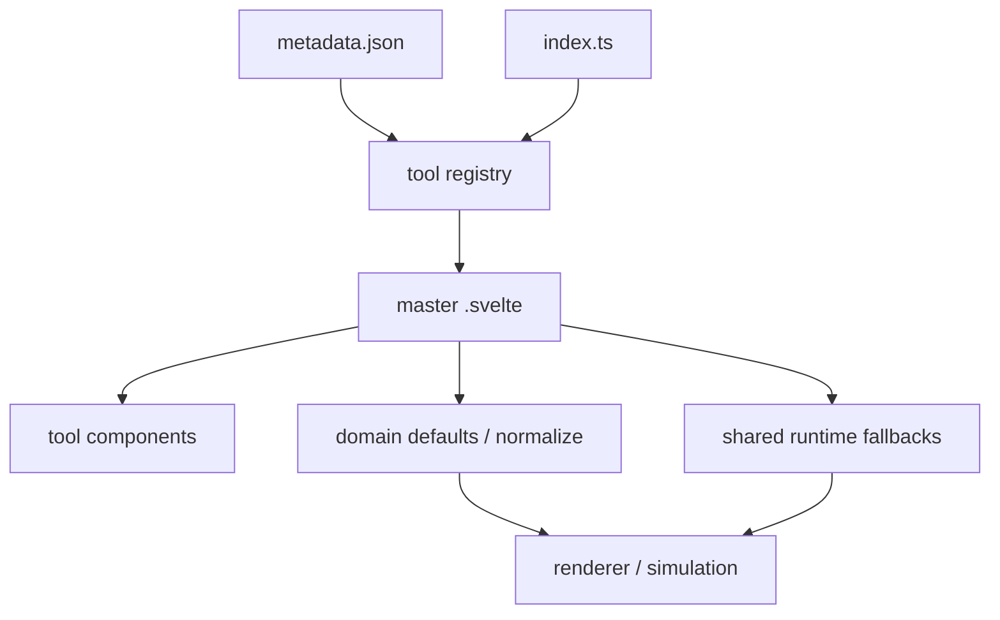

# Marble Design Toolset 代码分析

## 本次分析范围

| 项目 | 说明 |
|---|---|
| 对象 | 当前 `src/tools` 下 6 个 tool 的默认参数与初始状态放置位置 |
| 架构 | master Svelte + tool domain module + shared runtime |
| 结论 | 静态 metadata、runtime definition 与业务默认参数分层；复杂参数使用默认工厂和 normalize |

## 架构地图

## 系统索引

| 系统 | 说明 | 文档 |
|---|---|---|
| Tool 默认参数与初始状态 | 逐个 tool 追踪默认值、预设、normalize、控件范围和 runtime fallback | [systems/tool-default-parameters.md](systems/tool-default-parameters.md) |

## 关键结论

1. `metadata.json` 只放静态元数据，不放默认状态。
2. `index.ts` 只放 runtime definition、tech stack 和懒加载入口，不放业务默认值。
3. 简单 tool 将初始 `$state` 放在 master `.svelte`；`noise` 与 `shallow-water-height` 将参数默认值抽到领域模块的 `createDefault*()`。
4. `preset-init-map.ts` 和 layout/file-input/export/PreviewCanvas 中的默认值属于共享 runtime，不应被误认为某个 tool 的业务参数。
5. 当前主要重复风险在 `chromatic-aberration` 的 shader uniform bootstrap 值，以及 `shallow-water-height` 的 Three uniform bootstrap 值。
