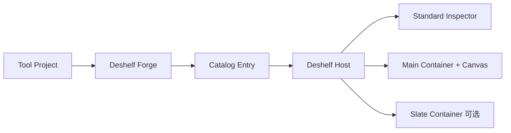

# Deshelf 目标架构

> 状态：已落地。Web/Desktop adapters 与 Shallow Water 迁移样本（`tools/shallow-water/`）已实现，旧同 realm runtime 已删除（Linear MAB-65…MAB-70）。本文同时是设计 reference 与当前 architecture。

## 1. 设计立场

Deshelf Web 与 Deshelf Desktop 运行同一份 Visual Tool 源码，并保持相同 Tool Session 语义。性能优先：rAF、Three/Pixi/WebGPU、simulation state 与 Canvas pixels 留在 Tool Container 内，不经过 Environment API。

Tool Container 是 Host 提供的运行 realm，用于环境供给、统一生命周期和 Session 间隔离。它不是防御恶意 Visual Tool 的安全产品；Web same-origin iframe 也不承诺故障或进程隔离。



## 2. deep modules

```text
packages/tool-contract/   Manifest、Catalog descriptor、Environment API 类型/schema
packages/tool-sdk/        defineVisualTool、Tool Container 内 client
packages/tool-host/       Catalog 消费、Session、Store、Inspector、adapter interface
packages/tool-builder/    扫描、编译、descriptor extraction、Catalog upsert
apps/web/                 静态 Catalog、same-origin iframe adapter
apps/desktop/             Project Catalog、WebContents + MessagePort adapter
tools/shallow-water/      第一份迁移样本
```

这四个 packages 是外部 seams。Inspector、Asset Input 与 Export 先留在 `tool-host` implementation 内，避免 shallow packages。Environment API 因 Web/Desktop 存在两个 adapters 而成为真实 seam。

## 3. Tool Project

最小目录：

```text
shallow-water/
├─ manifest.json
├─ tsconfig.json
├─ index.ts
├─ canvas/
│  └─ Canvas.svelte
└─ .deshelf/          # generated，gitignore
```

按需增加 `parameters.ts`、`assets.ts`、`commands.ts`、`callbacks.ts`、`outputs.ts`、`inspector.ts`、`sim/` 与 `slate/`。这些文件只是私有组织，唯一登记点仍是根 `index.ts`。约束：

- `manifest.json` 是根目录唯一 Tool Manifest。
- Tool Entry 固定为 `./index.ts`，Manifest 不写 `entry`。
- `index.ts` 只有一份 `export default defineVisualTool(...)`，顶层无副作用。
- Canvas 与 Tool Slate 使用动态 import。
- Tool 不自带 `node_modules`、第三方 package 或 Vite/Svelte config。
- `.deshelf/` 只服务 IDE，不进入 Catalog 或 Tool Bundle。
- Bundle、cache 与 Session state 不写回 Tool Project。

## 4. Tool Manifest

```json
{
  "contractVersion": 1,
  "projectId": "8f2c1a0e-…",
  "slug": "shallow-water",
  "name": "Shallow Water",
  "description": "Generate shallow-water height animations.",
  "tags": ["simulation", "height-map"],
  "version": "1.0.0",
  "forgeProfile": "forge-v1",
  "libraries": ["three"]
}
```

`description` 与 `tags` 是可选静态展示 metadata，用于 Tool Info。Manifest 不写 Parameter、Command、Inspector、Capability、Slate、Export 或 `enabled`。Tool availability 属于 Catalog Source/Host 配置。

发现不能只认 `manifest.json` 文件名，必须验证 Deshelf identity fields。`projectId` 是不可变逻辑身份；复制 Folder 不自动改 ID。

## 5. 构建期 extraction 与 Catalog

作者只登记 Tool Manifest 与 Tool Entry。Tool Session 不承担注册。

```ts
export default defineVisualTool({
  parameters: { /* definitions */ },
  assets: { /* typed Asset Slot definitions */ },
  commands: { /* public definitions + callbacks */ },
  privateCallbacks: {
    resimulate: defineInspectorCallback({ run() { /* Main-only callback */ } })
  },
  outputs: { /* Visual Output definitions + callbacks */ },
  createInspector({ root, parameters, assets, commands, privateCallbacks }) {
    /* build tree; bind buttons through privateCallbacks.resimulate */
  },
  canvas: () => import('./canvas/Canvas.svelte'),
  slate: () => import('./slate/Slate.svelte'),
  dispose() {}
});
```

Forge pipeline：

```text
read Manifest
  → compile index.ts
  → evaluate definition in extraction realm
  → execute createInspector against descriptor-only SDK
  → validate
  → emit Main/Slate artifacts
  → upsert Catalog Entry
```

Package ownership 必须明确：`tool-sdk` 只提供作者侧的 inert declarations/builders（包括 `defineVisualTool` 与 Inspector Tree builders），不扫描 Project、不创建 extraction realm、不执行 Tool Entry，也不生成 Catalog；`tool-builder` 拥有 compilation、受控执行、调用 `createInspector`、descriptor extraction/validation、artifact emission 与 Catalog upsert。SDK 产生的是可被 Builder 观察的 declaration/Inspector AST，Builder 才是 extractor。

Catalog Entry 包含：

```ts
type CatalogEntry = {
  catalogEntryId: string;
  source: CatalogSourceRef;
  projectId: string;
  slug: string;
  name: string;
  description?: string;
  tags?: string[];
  version: string;
  forgeProfile: string;
  libraries: string[];
  artifacts: { main: string; slate?: string };
  parameters: ParameterDescriptorMap;
  assets: AssetSlotDescriptorMap;
  commands: ToolCommandDescriptorMap;
  privateCallbacks: PrivateCallbackDescriptorMap;
  outputs: VisualOutputDescriptorMap;
  inspectorTree: InspectorTreeDescriptor;
  surfaces: { canvas: true; slate: boolean };
};
```

函数、Svelte components、DOM 与 Framework Library objects 不进入 Catalog。Parameter compute、Tool Command callback、Inspector private callback 与 `dispose` 留在 Main artifact。

### Catalog identity

`projectId` 是逻辑身份，不足以充当 Catalog primary key，因为同一 Project ID 可以存在于多个 Project Locations。Host 生成 `catalogEntryId`，其来源为 `CatalogSourceRef + projectId`：

```ts
type CatalogSourceRef =
  | { kind: 'web'; sourceId: string }
  | { kind: 'desktop'; projectLocationId: string };
```

Reload 只 upsert 当前 `catalogEntryId`。不同 Location 的同 Project ID 可以并存，不互相覆盖。

### Extraction 风险

Extraction realm 必须有 timeout、确定性输入和仅 descriptor 的 SDK implementation。它不得挂载 Svelte、创建 GPU context 或访问 Host UI。

Inspector private callback 使用已确定的 **named map**：Tool 作者在 Tool Entry 的 `privateCallbacks` map 中以 key 定义稳定 ID，`createInspector` 只绑定 `privateCallbacks.<id>` handle。Catalog 保存 `{ kind: 'private-callback', callbackId }`，实际函数留在 Main artifact。作者不重复填写 `id`，Forge 禁止 inline anonymous callback，并验证 map key、Binding 与 Main callback table 一致。不得用源码正则抽取 callback。

## 6. Host 与 Tool Containers

Host 仅凭 Catalog Entry 即可同步创建 Parameter Store 与 Standard Inspector，不等待 Tool Container。

- Main Container：必需，运行 Main artifact、simulation、callbacks 与 Canvas。
- Slate Container：可选，运行 Tool Slate；不与 Main 共享 JavaScript realm。
- Standard Inspector：Host-owned，不进入 Container。
- Tool Slate failure 不阻塞 Canvas Ready，但产生 Surface diagnostic。

Bootstrap 注入 `sessionId`、endpoint role、Parameter snapshot、Asset snapshot、Surface 尺寸、Framework Libraries 与当前 Environment Inventory。

## 7. Environment API

Environment API 是轻量管理面，不是 Capability/ACL 安全协议。Web 与 Desktop 共享 discriminated union 与 runtime schema，只替换 adapter。

启动只有：

```ts
type BootMessage = {
  protocolVersion: 1;
  sessionId: string;
  endpoint: 'main' | 'slate';
  parameters: ParameterSnapshot;
  surface: {
    kind: 'canvas' | 'slate';
    width: number;
    height: number;
  };
};

type ReadyMessage = {
  sessionId: string;
  endpoint: 'main' | 'slate';
  surface: 'canvas' | 'slate';
};
```

不使用 `hello`、`welcome`、`tool.register`、Grant、nonce、`endpointId` 或每条 `sequence`。endpoint 由 transport channel 角色确定；Reload/Restart 更换 `sessionId`，旧消息直接丢弃。

运行消息只保留：

```text
parameter.snapshot | changed | set | compute
command.execute | cancel | result | status
surface.resize | dispose
asset.*
export.*
diagnostic.emit
```

控制消息保持小型化，这是性能卫生，不是固定安全上限。function、DOM、Svelte component、Framework Library object、simulation state 与 Canvas pixels 不过 seam。Web Asset adapter 可以交付 blob/用户选择结果；Desktop 不向 Tool 暴露真实路径。

### Asset Input 与 Visual Output

Tool Entry 的 `assets` map 以稳定 key 声明 typed Asset Slots；Forge 抽取 descriptors，Host 持有选择结果、迁移与资源释放，Container 通过 Environment client 获取内容。Tool Project 不直接拥有 picker、真实文件路径或跨 Session 对象 URL。

Tool Entry 的 `outputs` map 以稳定 key 声明 Visual Output descriptors 与 Main-only callbacks；Forge 把格式、尺寸规则和显示 metadata 抽入 Catalog，实际 render/encode callback 留在 Main artifact。Host 根据 descriptors 渲染 Export UI，并通过 `export.*` 管理执行。禁止 Canvas mount 后再 runtime 注册 exporter。

## 8. Parameter 与 Inspector

Host 是 Parameter Store 唯一权威。Inspector Tree 在构建期进入 Catalog；Session 中 Host 直接渲染。没有 `createInspector` 时，Host 按 Parameter descriptors 生成默认 Tree。

Pointer 热路径留在 Host 控件：本地更新显示，经 rAF 或 pointerup 合并后才发送 `parameter.set(id, value, expectedRevision)`。Store 通过 type、mode、Constraint 与 revision validation 后发送 `parameter.changed` 给 Main。

computed 由 Host 调度，Main 运行短函数。compute callback 不访问 GPU/IO；非法值保留上一合法值并产生 diagnostic。Tool Slate 改参同样经过 Host Store。v1 不提供 Canvas ↔ Slate 私有 bus。

## 9. Session lifecycle

```text
Cataloged → HostReady → Booting → Ready
                         Booting → Failed
Ready | Failed → Closed
```

- Cataloged：Manifest、编译与 extraction 成功。
- HostReady：Parameter Store 与 Standard Inspector 已建立。
- Booting：Main Container 已收到 boot。
- Ready：收到 Canvas `surface.ready`。
- Failed：加载、版本、Entry error 或 startup timeout。

`Unresponsive` 是 Ready Session 的 health，而不是额外 startup stage。Tool Command callback 超时且未响应 cancel 时，health 变为 Unresponsive；Host chrome 提供 Restart Tool。

Slate Container 在 Main Ready 后独立 boot，不阻塞首帧。

## 10. Reload、Restart 与 Reset

Reload 使用 staged replacement：

```text
new Catalog Entry
  → Host 根据新旧 descriptors 计算 staged Parameter/Asset migration
  → 用 staged snapshot boot replacement Main Container
  → replacement Canvas Ready
  → 原子提交 staged Host state 并切换 active Session
  → dispose old Container
```

replacement 失败时释放 staged resources 并保留旧 Session。同一 Tool Session 同时最多存在一套 replacement。

Restart 不构建，使用当前 Catalog Entry 与 artifact 创建新 Session ID。Reset Defaults 只恢复 manual/overrideable defaults 并重算 computed，不替换 Container。

## 11. Web 与 Desktop adapters

| Concern | Deshelf Web | Deshelf Desktop |
|---|---|---|
| Tool Source | 构建扫描约定目录 | Open Project |
| Catalog | 静态生成 | Project build 成功后更新 |
| Container | same-origin iframe | 独立 WebContents |
| Transport | iframe adapter | MessagePort adapter |
| Tool code | 预编译 | 受控 Builder 编译 |
| Asset/Export | browser adapter | desktop adapter，路径不进 Tool |

两端共用 Tool Manifest、Tool Entry、Catalog Entry、Environment API、Parameter/Inspector 语义和 conformance tests。

### Web 实现要点

- 构建期由 `scripts/build-web-catalog.ts` 扫描 `tools/`，调用共享 Builder 并原子发布 `static/deshelf/` 下的静态 Catalog、预编译 artifacts、Framework Library bundles 与容器页；失败条目不进入可用 Catalog。
- 容器页以 import map 供给 `svelte` 与声明的 Framework Libraries；共享 internals 落在 shared chunks，保证单一 runtime 实例。
- 容器 iframe 有意不设 `sandbox`：sandbox 会产生 opaque unique origin，破坏同源供给；同样不引入 Capability Grant。
- **风险声明**：same-origin iframe 与 Host 同处一个 renderer process，Tool 死循环会卡死页面；产品接受此风险，不承诺 failure isolation，Restart 位于 Host chrome。实现细节与风险记录见 [`../for-framework-developers/web-iframe-adapter.md`](../for-framework-developers/web-iframe-adapter.md)。

### Desktop 实现要点

- Open Project 身份：`projectId` 是 Manifest 的不可变逻辑身份，`projectLocationId` 来自 realpath 哈希；同 Project ID 多 Location 经 `catalogEntryId` 天然隔离，Catalog 按 Location 分文件持久化于 AppData cache。
- 受控 Builder：构建在隔离子进程执行（hard timeout + kill），Forge Profile 指向随应用发行的已编译 worker resources；构建产物按源内容哈希存入不可变 build 目录，未变更工程直接命中 cache。
- 构建（含 Reload）成功后写入 `.deshelf/` IDE declarations 与 schema，并幂等维护工程 `.gitignore`；这是对 Tool Project 的唯一写回。
- 容器 realm 是独立 WebContents（sandbox + contextIsolation、无 Node），Main 进程只做一次性 MessagePort handoff，此后 Environment 流量在 Host renderer 与容器 renderer 之间点对点流转，不经 Main 逐消息转发；Restart/Close 由 realm manager 统一销毁，不泄漏 WebContents/ports。
- Asset/Export 留在 Desktop environment adapter：文件对话框、字节缓存与写盘确认全在 Main；容器只见 opaque 的 `deshelf-cache://session-assets/<handle>` URL 与可序列化 export result，真实文件路径不进入 Tool Container。实现细节见 [`../for-framework-developers/desktop-adapter.md`](../for-framework-developers/desktop-adapter.md)。

## 12. 当前迁移原则
旧实现中的 `tool-registry.ts`、`metadata.json`、root master Svelte component、Tool-owned LeftPanel/RightPanel、Tool-owned source controller、同 realm Svelte contexts 与 runtime exporter registration 是待替换 implementation，不得继续深化。

迁移以 Shallow Water 为唯一验证 Tool，并按下列独立工作流推进：

1. Catalog 与 build-time extraction；
2. Environment API contract 与 Host Session core；
3. Web same-origin iframe adapter；
4. Desktop WebContents + MessagePort adapter；
5. Shallow Water Tool Project migration。
