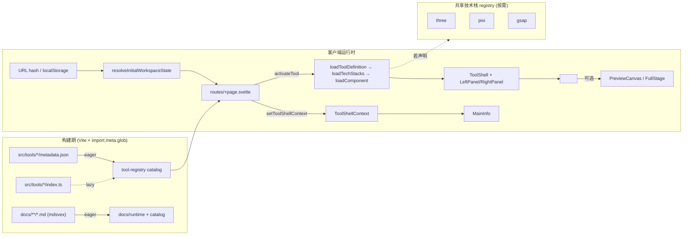

# Marble Design Toolset 架构分析报告

> 基于当前仓库实际代码（`src/`、`scripts/`、`openspec/specs/` 等）整理，反映已实现状态而不是设想状态。

## 1. 项目定位

Marble Design Toolset 是一个静态托管的 SvelteKit 应用，用于承载多个相互独立的横屏 2D 设计工具。框架本身不绑定具体业务逻辑，而是提供：

- 一个由框架完全拥有的 workspace shell（顶部条 + 标签栏 + 左右分栏 + 持久化）。
- 一套基于 Bits UI + 手写布局组件的像素风 UI 基础层。
- 一个工具运行时：metadata 即时发现 + 运行时定义按需懒加载 + heavy tech stack（`three` / `pixi` / `gsap`）共享缓存加载。
- 一个基于 mdsvex 的仓库内文档浏览器（构建期遍历 `docs/**/*.md`）。
- 一个生成新工具骨架的交互式脚手架（`bun run create:tool`）。

所有硬约束（文件结构、UI 基线、视口规则、技术栈隔离）见根目录 [AGENTS.md](AGENTS.md) 与 [openspec/specs/](openspec/specs/)。

## 2. 技术栈与构建

来自 [package.json](package.json)：

- **框架**：SvelteKit `^2.57`，Svelte `^5.55`（强制 runes 模式，`svelte.config.js` 中针对非 `node_modules` 文件强开 `runes: true`）。
- **构建**：Vite `^8`，使用 `@sveltejs/vite-plugin-svelte` 与 `@sveltejs/adapter-static`（输出到 `build/`，禁用 fallback、严格模式）。
- **Markdown**：mdsvex `^0.12.7` + rehype-highlight，扩展名 `.md` 直接被 SvelteKit 视为可路由模块。
- **UI 基础库**：bits-ui `^2.17`，pixelarticons `^2.0`，geist 字体（GeistPixel-Square）。
- **可选 heavy 依赖**：three `^0.183`、pixi.js `^8.17`、gsap `^3.14`，通过 runtime 共享 registry 按需加载。
- **脚手架**：`bun run create:tool`（脚本本身用 Node 也可运行，readline 交互式）。
- **测试**：`node --test` 跑分散的 `*.test.ts` / `*.test.mjs`，覆盖 docs catalog、tool availability、tech stack registry、PreviewCanvas zoom/footer 计算与脚手架行为。

构建命令统一入口 `npm run build`，prerender 由 [src/routes/+layout.js](src/routes/+layout.js) 中的 `export const prerender = true` 触发，整个站点（含 `/docs/*` 路由）以纯静态文件形式产出。

## 3. 顶层目录结构

```
src/
├── app.css                    # 全局 CSS 令牌、像素工具类、滚动条等基线样式
├── app.html                   # SvelteKit shell HTML 模板
├── lib/
│   ├── assets/ui/             # 共享像素边框/字体资源
│   ├── components/
│   │   ├── shell/             # 框架级布局组件（手写）
│   │   └── ui/                # 交互原子组件（基于 bits-ui 的包装层）
│   ├── docs/                  # mdsvex 文档浏览器的 catalog/runtime 工具
│   ├── runtime/               # 工具注册表、tech-stack registry、工作区状态
│   └── types/                 # 公共 TS 类型（tool / tech-stack）
├── routes/
│   ├── +layout.{svelte,js}    # 注入全局 CSS、声明 prerender
│   ├── +page.svelte           # 工作区入口（hash 路由 + tab 管理）
│   └── docs/                  # mdsvex 文档浏览器
└── tools/<tool-id>/           # 业务工具模块
scripts/
├── create-tool.js             # 脚手架 CLI 入口
└── tool-scaffold/             # 脚手架核心 + 模板 + 测试
docs/                          # 中文开发者文档（架构、指南）
openspec/                      # OpenSpec 规范与变更追踪
static/                        # 静态资源直通
```

## 4. 路由与渲染模型

- **入口路由**：`/`（[src/routes/+page.svelte](src/routes/+page.svelte)），客户端在 hydration 后读取 `window.location.hash` 与 `localStorage`，恢复已打开工具集合与活动工具，并把状态变化反向写回 hash 与 localStorage。
- **文档浏览器路由**：`/docs/[...slug]`（[src/routes/docs/[...slug]/](src/routes/docs/%5B...slug%5D/)）。`+layout.server.ts` 通过 [src/lib/docs/metadata.ts](src/lib/docs/metadata.ts)（在仓库中实际即 `catalog.ts`+`runtime.ts` 的组合层）拿到 catalog 树，渲染左侧导航。
- **prerender**：`+layout.js` 中的 `export const prerender = true` 让 adapter-static 把所有可发现路由烘焙成静态 HTML；`/` 仅渲染壳层，工具内容仍在客户端动态加载。

## 5. Workspace Shell 与 Tab 模型

工作区入口 [src/routes/+page.svelte](src/routes/+page.svelte) 是整个应用的 orchestrator，负责：

1. **目录加载（同步）**：`getToolCatalog()` 从 `tool-registry.ts` 取出已 eager 解析过的 metadata 列表（已按 `enabled !== false` 过滤、按 name 排序）。
2. **状态恢复**：`resolveInitialWorkspaceState(validToolIds)` 综合 hash + localStorage + 默认值，得到 `{ openToolIds, activeToolId, leftPanelWidthVw }`，仅在 `browser` 时执行。
3. **Tab 管理**：`openTabs` 由 `openToolIds` 派生为 `TabItem[]`，传给共享 `Tabs` 包装层。`activateTool` / `closeTool` 维持 open 列表与 active 标识；关闭最后一个 tab 时退到空状态界面。
4. **持久化与 hash 同步**：`$effect` 同步把状态写入 localStorage、把 `activeToolId` 写入 hash；监听 `hashchange`，允许从外部 URL 切换活动工具。
5. **tool 加载流水线**：当 `activeToolId` 变化时启动一个带 `toolLoadVersion` 的异步任务：`loadToolDefinition` → `loadTechStacks(definition.techStack)` → `definition.loadComponent()`，期间 UI 显示 Loading；过期请求会被 `currentLoad !== toolLoadVersion` 守卫忽略，避免快速切换时旧组件覆盖新组件。
6. **shell context 注入**：通过 [src/lib/runtime/tool-shell-context.ts](src/lib/runtime/tool-shell-context.ts) 的 Svelte context API，把当前工具的 `metadata` / `menuActions` / `openAbout` / `onMenuAction` 暴露给 `MainInfo`，工具自身无需重新声明这些信息。
7. **顶层 chrome**：Header（Open / Help / Docs / Settings）、Tabs、`<ToolShell>` 容器、Open / Help / Settings / About 四个 `Dialog`。Docs 入口是普通 `<a href="/docs">`，不属于 workspace shell 状态。

工具被挂载时，`+page.svelte` 渲染：

```svelte
<ToolShell {leftPanelWidthVw}>
    <ActiveComponent />
</ToolShell>
```

`ActiveComponent` 来自工具自己的 master `.svelte`，工具内部必须使用 framework-owned 的 `LeftPanel` / `RightPanel` 等容器组合自身 UI，不可重定义顶层 grid。

## 6. 框架壳层组件（src/lib/components/shell）

| 组件 | 文件 | 职责 |
|---|---|---|
| `ToolShell` | [tool-shell/ToolShell.svelte](src/lib/components/shell/tool-shell/ToolShell.svelte) | 顶层 grid（左面板宽度 = `min(288px, --tool-shell-left-panel-width)`，右面板 `1fr`），通过 `--tool-shell-left-panel-width` CSS var 接收 `leftPanelWidthVw` |
| `LeftPanel` | [left-panel/LeftPanel.svelte](src/lib/components/shell/left-panel/LeftPanel.svelte) | 在最顶部强制渲染 `MainInfo`，下方 slot 接收工具左侧片段；支持像素滚动条 |
| `MainInfo` | [main-info/MainInfo.svelte](src/lib/components/shell/main-info/MainInfo.svelte) | 框架拥有的工具信息块，标题/描述来自 `ToolShellContext`，附带 `DropdownMenu`（菜单动作 + About） |
| `Section` | [section/Section.svelte](src/lib/components/shell/section/Section.svelte) | 左面板内的标准块，支持 `collapsible` 模式（基于 Bits UI Collapsible） |
| `RightPanel` | [right-panel/RightPanel.svelte](src/lib/components/shell/right-panel/RightPanel.svelte) | 仅提供视觉基线（背景 + flex 容器），不强制结构；工具自由放 PreviewCanvas / FullStage / 自定义内容 |
| `PreviewCanvas` | [preview-canvas/PreviewCanvas.svelte](src/lib/components/shell/preview-canvas/PreviewCanvas.svelte) | 2D 内容预览壳层，提供 Fit / 1:1 / 手动缩放、棋盘格、拖拽平移、外置信息块 footer，对外暴露的缩放百分比为 device-pixel 归一化后的 logical zoom |
| `FullStage` | [full-stage/FullStage.svelte](src/lib/components/shell/full-stage/FullStage.svelte) | 全尺寸 stage 容器，负责 overflow/flex 基线，不做缩放 |

`PreviewCanvas` 还有两个支撑模块：

- [zoom.js](src/lib/components/shell/preview-canvas/zoom.js)：`computePreviewCanvasFitZoom`、`clampPreviewCanvasZoom`、`computePreviewCanvasRenderScale` 等纯函数，处理 logical zoom 与 render scale 的换算，单独由 `zoom.test.mjs` 覆盖。
- [footer-info.js](src/lib/components/shell/preview-canvas/footer-info.js) + `PreviewCanvasFooter.svelte`：实现外置信息块的"首行三模式 + 最多 5 行 + 静默裁剪"约束（详见 `right-panel-modes` spec）。

## 7. UI 原子组件（src/lib/components/ui）

| 目录 | 角色 |
|---|---|
| `button/` | Bits UI Button 包装，统一变体（solid/ghost/outline）与尺寸 |
| `dialog/` | Bits UI Dialog 包装，遵循 wrapper + inner 双层 props 透传 |
| `dropdown-menu/` | Bits UI DropdownMenu 包装，输入项支持 `separator` |
| `collapsible/` | Bits UI Collapsible 包装，被 `Section` 复用 |
| `tabs/` | 自有 tab 实现，输出 `TabItem[]` 接口（标题 + 可关闭） |
| `pixel-icon/` | 渲染 raw SVG 像素图标（基于 pixelarticons） |

所有 UI 组件遵循 [openspec/specs/pixel-ui-foundation/spec.md](openspec/specs/pixel-ui-foundation/spec.md) 中的硬约束：

- 交互型必须基于 Bits UI；布局型不可使用 Bits UI。
- 使用 Bits UI 的 `child` snippet 时，必须保留 `wrapperProps` + `props` 双层结构，且外层 wrapper 不承载视觉样式。

## 8. Tool Runtime（src/lib/runtime）

### 8.1 Tool Registry

[src/lib/runtime/tool-registry.ts](src/lib/runtime/tool-registry.ts) 在模块求值阶段做两件事：

```ts
const metadataModules = import.meta.glob('/src/tools/*/metadata.json', { eager: true });
const definitionModules = import.meta.glob('/src/tools/*/index.ts'); // lazy
```

- `metadata.json` 全部 **eager** 加载，构成 `catalog`，并经 `filterEnabledTools` 过滤掉 `enabled === false` 的工具，按 name 排序。
- `index.ts` 仅做 **lazy** 注册，`loadToolDefinition(toolId)` 在工具被激活时才触发动态 import。
- `isValidToolId` 由 `catalogIds` 集合判定，hash 路由与 localStorage 恢复都以它为唯一来源——这意味着 `enabled: false` 的工具同时被排除出 deep-link 与持久化恢复链路。

### 8.2 Tool Definition 类型

[src/lib/types/tool.ts](src/lib/types/tool.ts)：

```ts
interface ToolDefinition {
    metadata: ToolMetadata;             // 来自 metadata.json
    menuActions?: ToolMenuAction[];     // MainInfo 的下拉项（除 About）
    techStack?: TechStackKey[];         // 仅 'three' | 'pixi' | 'gsap'
    loadComponent: () => Promise<{ default: Component<any> }>;
}
```

`ToolCatalogItem = ToolMetadata & { id: string }`，`id` 由路径 `/src/tools/<id>/metadata.json` 反推（kebab-case）。`metadata.enabled` 缺省视为 `true`，仅显式 `false` 视为禁用。

### 8.3 Tech Stack Registry

[src/lib/runtime/tech-stack.ts](src/lib/runtime/tech-stack.ts) 维护一个键到 dynamic import 的映射 + Promise 缓存：

```ts
const loaders = {
    three: () => import('three'),
    pixi:  () => import('pixi.js'),
    gsap:  () => import('gsap')
};
```

- `loadTechStack(key)`：单 key 加载，复用缓存。
- `loadTechStacks(keys?)`：批量加载，返回类型为 `LoadedTechStacks<Keys>`，使工具内部能 `const { three } = await loadTechStacks(['three'])` 拿到强类型模块。
- 多个工具共享同一 key 时不会重复加载，未声明的 key 永远不会进入 bundle 主图。

### 8.4 Workspace State

[src/lib/runtime/workspace-state.ts](src/lib/runtime/workspace-state.ts) 提供：

- `STORAGE_KEY = 'marble-design-toolset:workspace'`。
- `clampLeftPanelWidthVw`：左面板宽度限制在 `[22, 40]` vw，默认 28。
- `readHashToolId` / `writeHashToolId`：在 hash 与 active tool id 间双向同步（写入用 `replaceState`，避免污染历史栈）。
- `readStoredWorkspaceState` / `resolveInitialWorkspaceState` / `persistWorkspaceState`：与 `tool-availability.js` 的 `sanitizeWorkspaceToolSelection` 一起，在每次读写时丢弃不存在或被禁用的 tool id。

### 8.5 Tool Availability

[src/lib/runtime/tool-availability.js](src/lib/runtime/tool-availability.js) 是纯 JS 工具集（带 JSDoc 类型），承担两件事：

- `isToolEnabled` / `filterEnabledTools`：把 `enabled` 字段映射成布尔。
- `sanitizeWorkspaceToolSelection`：把 `Partial<WorkspaceState>` 收敛为 `{ openToolIds, activeToolId }`，确保 tool id 在 `validToolIds` 集合内，否则丢弃；并把首个 open id 作为 active id 兜底。

### 8.6 Tool Shell Context

[src/lib/runtime/tool-shell-context.ts](src/lib/runtime/tool-shell-context.ts) 用 Svelte context API 暴露 `{ metadata, menuActions, openAbout, onMenuAction }`，由 `+page.svelte` 在每次工具切换时更新；`MainInfo` 与 `LeftPanel` 通过 `getToolShellContext()` 读取。

### 8.7 Canvas Export Runtime

[src/lib/runtime/canvas-export/](src/lib/runtime/canvas-export/) 是 framework-owned 的画布导出模块，与 `tool-shell-context` 平行存在但完全解耦。结构：

- `context.ts`：独立的 Svelte context（`getCanvasExportContext` / `setCanvasExportContext`）。**由 `ToolShell.svelte` 顶层注入**，因此 LeftPanel、PreviewCanvas、FullStage 与 tool 任意子组件均可读取 / 调用 `register(...)`。Export context 与右侧呈现容器的具体选择完全解耦。
- `registry.svelte.ts`：`createCanvasExportRegistry()` 返回基于 `$state` 的 exporter 注册表，并包含 `resolveCapabilities(descriptor)` —— 一个对 `CanvasExporterDescriptor` 应用安全约束的纯函数（`kind=dom` 强制 `mp4=false` / `pngBitDepth=8`，缺少 `getPixels16` / `renderFrame16` 时 `pngBitDepth=16` 自动降级为 8）。
- `png.ts`：8-bit PNG 编码（`canvas`、`render`、`dom` 三种 kind）通过浏览器原生 `canvas.toBlob('image/png')` 完成；`dom` 模式走 SVG `<foreignObject>` → `` raster 路径。
- `png16.ts`：16-bit PNG 通路。`fast-png` 编码器通过 `await import('fast-png')` 懒加载，**不进入首屏 bundle**。仅在 exporter 显式声明 `capabilities.pngBitDepth === 16` 且提供 `getPixels16` / `renderFrame16` 时才被触发。
- `mime.ts`：`pickRecorderMime()` 按 `mp4 (avc1) → webm (vp9) → webm (vp8)` 顺序探测 `MediaRecorder.isTypeSupported`，并把结果交给 UI 决定文件后缀与提示信息。
- `mp4.ts`：`MediaRecorder` + `canvas.captureStream` 录制；`render` 模式使用 `captureStream(0)` + `videoTrack.requestFrame()` 手动驱动以确保每帧都来自 `renderFrame` 的确定输出。
- `download.ts`：共享的 `triggerDownload(blob, filename)` 与 `defaultExportFilename(toolId)`。

`CanvasExporterDescriptor` 必填 `contentWidth` / `contentHeight`（可使用 getter 保持响应式），framework 据此驱动离屏 canvas 尺寸；任何容器组件 **不再** 向 export runtime 提供尺寸信息。

**Export UI 已下放至 LeftPanel 底部**：`src/lib/components/shell/export-section/ExportSection.svelte` 由 `LeftPanel.svelte` 在所有 tool 自定义 Section 之后条件渲染。是否渲染由 `ToolMetadata.export = { image?: boolean; video?: boolean }` 控制 —— 两个标志均缺省/false 时 LeftPanel 不出现 Export Section。当声明了能力但运行时未注册 exporter 时，按钮保持 disabled 并在 Section 内提示。Export Section 是嵌入式面板，**不弹 Dialog**；导出结果在 Section 底部内联展示。PreviewCanvas 工具栏不再渲染任何 Export 控件。

> **路线图预留**：`fast-png` 仅覆盖 16-bit PNG。未来会通过独立的 OpenSpec change（候选名 `add-canvas-export-ffmpeg`）以同样的懒加载 + capability 模式接入 `@ffmpeg/ffmpeg`，覆盖高位深视频、ProRes、APNG / GIF、容器互转。该路径强制 host 提供 COOP/COEP headers，并独立承载 docs 章节。

## 9. Tool 模块契约

来自 [openspec/specs/tool-module-runtime/spec.md](openspec/specs/tool-module-runtime/spec.md) 与 AGENTS.md 的硬约束：

- 必有目录 `src/tools/<tool-id>/`，`tool-id` 使用 kebab-case。
- 必含三类文件：
    1. `metadata.json` —— 仅静态字段（`name`, `desc`, `tag`, `version`, 可选 `enabled`），不允许放 runtime 装配字段。
    2. `index.ts` —— 默认导出 `ToolDefinition`，包含 `metadata`、可选 `menuActions`、可选 `techStack`、必填 `loadComponent`。
    3. **唯一**的 root-level master `.svelte`，文件名为 `tool-id` 的 PascalCase 形式。
- 其余 `.svelte` 私有子组件全部放 `components/`（如 `aspect-ratio/components/{DimensionFields,PresetGrid}.svelte`）。
- 工具不重定义 workspace shell；只在 master `.svelte` 内通过 `LeftPanel + Section + (PreviewCanvas | FullStage | 自由内容)` 组合自身 UI。

当前仓库内的工具模块：

- `aspect-ratio/`（启用，preview starter）
- `noise-texture-creater/`（启用，preview starter）
- `hello-world/`（最小示例）
- `three-cube/`（声明 `techStack: ['three']`，`enabled: false`，作为 stage starter 示例样本）

## 10. Tool 脚手架（scripts/）

[scripts/create-tool.js](scripts/create-tool.js) 是仓库内 CLI 入口，启动一个 `readline` 会话调用 `tool-scaffold/`：

- 通过 `collectScaffoldOptions` 询问：tool name → tool id（kebab-case 派生）、starter type（`preview` 或 `stage`）、tech stack 多选（`three` / `pixi` / `gsap`，可空选）。
- `createToolScaffold` 在 `src/tools/<tool-id>/` 下生成符合 schema 的最小骨架：`metadata.json`、`index.ts`（仅在用户选了 tech stack 时写入 `techStack`）、PascalCase master `.svelte`、必要时的 `components/`。
- 对已存在的目录直接报错退出，避免覆盖正在开发的工具。
- 行为有 [scripts/tool-scaffold/scaffold.test.mjs](scripts/tool-scaffold/scaffold.test.mjs) 覆盖（注册在 `npm test` 中）。

`bun run create:tool` 是推荐入口，但脚本本身依赖 Node 标准库，理论上可用 Node 直接执行。

## 11. 文档浏览器（src/routes/docs + src/lib/docs）

- 路由 `/docs/[...slug]` 全静态化。
- [src/lib/docs/catalog.ts](src/lib/docs/catalog.ts) 定义 `DocEntry`、`DocsTreeNode` 等结构，并实现 `buildDocsCatalog` —— 把传入的 markdown 路径列表（运行时由 `import.meta.glob` 收集）按 `docs/` 之下的目录层级展开成树，自动从 `# Heading` 提取标题，没找到则用 `humanize(stem)` 兜底，最后按 `zh-CN` collation 排序。
- [src/lib/docs/runtime.ts](src/lib/docs/runtime.ts) 用 `import.meta.glob('/docs/**/*.md', { eager: true })` 收集 mdsvex 编译后的 Svelte 组件，提供 `loadDocModule(importPath)`。
- `+layout.server.ts` 调用 `getDocsCatalog()` 返回 `tree` / `docCount` / `firstDoc`，`+layout.svelte` 渲染顶部信息条 + 左侧导航 + 主内容；导航递归组件是 `routes/docs/components/DocsNavGroup.svelte`。
- 因为 `/docs` 走 prerender + mdsvex，markdown 中的裸 `<` 会被 Svelte 编译器解释为标签，需要写为 `&lt;` 或包到代码块内（已在 repo 记忆里登记）。

## 12. 样式与设计令牌

[src/app.css](src/app.css) 定义全局基线：

- 字体：`GeistPixelSquare` 自托管（`node_modules/geist/dist/fonts/geist-pixel/...`）+ Noto Sans SC 与多种 monospace 兜底。
- 颜色：基于 `oklch()` 与 `--color-bg-step` 派生分层背景；提供 `--color-accent`、语义色（danger / success）、滚动条色等。
- 间距 / 字号 / 圆角 / 边框 / 动效全部使用以 `px` 为单位的 CSS Custom Properties（`--space-1..7`、`--font-size-1..5`、`--radius-sm/md/lg`、`--duration-*`、`--easing-standard`）。
- 工具类：`.pixel-scrollbar`（滚动条像素化）、`.pixel-frame`（外层像素化容器）、`.pixel-input`（输入框基线）、`.pixel-chip` 等。
- 全局 `body { overflow: hidden; }` 配合纯横屏工作区。

> 项目硬约束（AGENTS.md）：禁止使用 Tailwind；共享 UI 文案仅英文；视口 `< 720px` 时必须阻断正常 workspace 渲染。

## 13. 数据流总览



## 14. 测试与验证

`npm test` 直接以 `node --test` 运行下列文件：

- [src/lib/docs/catalog.test.ts](src/lib/docs/catalog.test.ts)
- [src/lib/runtime/tool-availability.test.mjs](src/lib/runtime/tool-availability.test.mjs)
- [src/lib/runtime/tech-stack.test.ts](src/lib/runtime/tech-stack.test.ts)
- [src/lib/components/shell/preview-canvas/zoom.test.mjs](src/lib/components/shell/preview-canvas/zoom.test.mjs)
- [src/lib/components/shell/preview-canvas/footer-info.test.mjs](src/lib/components/shell/preview-canvas/footer-info.test.mjs)
- [scripts/tool-scaffold/scaffold.test.mjs](scripts/tool-scaffold/scaffold.test.mjs)

`npm run build` 是事实上的"全量集成校验"，会触发：metadata 全量发现、所有工具 `index.ts` 与 master `.svelte` 的类型/编译检查、docs 浏览器静态化、adapter-static 输出。

## 15. OpenSpec 规范映射

[openspec/specs/](openspec/specs/) 下的规格是当前实现的"权威 contract"：

| Spec | 覆盖范围 |
|---|---|
| `tool-shell-workspace/` | workspace shell、Tab 模型、左右面板、PreviewCanvas 共享导航、URL hash 同步 |
| `pixel-ui-foundation/` | 设计令牌、Bits UI / 手写布局划分、像素资源策略、横屏 + 720px 视口约束 |
| `tool-module-runtime/` | Tool 文件 schema、运行时定义、metadata eager / 组件 lazy、tech stack 共享 registry、`enabled` 硬开关 |
| `right-panel-modes/` | RightPanel 的"自由 / PreviewCanvas / FullStage"三种模式契约 + 外置信息块规则 |
| `tool-scaffolding/` | `bun run create:tool` 的输入收集、产出文件、starter 模板与冲突保护 |

进行中的提案位于 `openspec/changes/`，归档版本位于 `openspec/changes/archive/`，是了解架构演进路径的主要来源。

## 16. 已知约束与边界

来自 AGENTS.md 与 repo memory，必须长期遵守：

- 样式禁止再引入 Tailwind；统一使用 CSS Custom Properties + `px`。
- 共享 UI 文案仅英文；纯横屏；视口 `< 720px` 时阻断正常渲染。
- 交互型基础组件：Button / Dialog / DropdownMenu / Popover / Collapsible / Tabs 必须基于 Bits UI 包装。
- 布局型组件：ToolShell / LeftPanel / RightPanel / MainInfo / Section / PreviewCanvas / FullStage 等必须手写。
- Bits UI `child` snippet 委托元素须完整透传 `{...props}`；浮动内容须保留外 `{...wrapperProps}` + 内 `{...props}` 双层结构。
- 工具不可重定义顶层 workspace shell；只能渲染左侧片段与右侧内容。
- 工具目录 schema 严格遵守，`tool-id` 与 PascalCase master 文件名一一对应；`metadata.json` 只放静态元数据。
- heavy 依赖（`three` / `pixi` / `gsap`）必须经共享 registry 声明 + 加载，禁止直接耦合到通用壳层。
- OpenSpec artifact 与 `docs/` 下的开发者文档统一中文撰写。

## 17. 二次开发建议路径

1. **加新工具**：`bun run create:tool` → 在生成的 master `.svelte` 内组合 `LeftPanel + Section + (PreviewCanvas | FullStage | 自由内容)` → `npm run build` 校验 → 需要时把 `metadata.enabled` 临时设为 `false` 隐藏未完成工具。
2. **加新共享 UI 原子**：放进 `src/lib/components/ui/<name>/`，必须基于 Bits UI；从 `index.ts` 重新导出；如果是布局型，则归入 `src/lib/components/shell/` 并手写。
3. **接入新 heavy 依赖**：在 [src/lib/runtime/tech-stack.ts](src/lib/runtime/tech-stack.ts) 的 `loaders` 中追加 key，并扩展 [src/lib/types/tech-stack.ts](src/lib/types/tech-stack.ts) 的 `TechStackModuleMap`；走 OpenSpec 流程更新规格。
4. **加新文档**：直接在 `docs/<group>/<name>.md` 中创建（保持中文 + 顶部 `# Title`），文档浏览器构建期自动收录；注意裸 `<` 须转义。
5. **修改 workspace 行为**：先看 `tool-shell-workspace` spec，再改 [src/routes/+page.svelte](src/routes/+page.svelte) 与 `src/lib/runtime/workspace-state.ts`，相关测试在 `tool-availability.test.mjs` 与 `zoom.test.mjs`。

---

附录路径速查：

- 入口路由：[src/routes/+page.svelte](src/routes/+page.svelte)
- Tool registry：[src/lib/runtime/tool-registry.ts](src/lib/runtime/tool-registry.ts)
- Tech stack registry：[src/lib/runtime/tech-stack.ts](src/lib/runtime/tech-stack.ts)
- Workspace state：[src/lib/runtime/workspace-state.ts](src/lib/runtime/workspace-state.ts)
- Tool 类型：[src/lib/types/tool.ts](src/lib/types/tool.ts)
- 设计令牌：[src/app.css](src/app.css)
- 脚手架：[scripts/create-tool.js](scripts/create-tool.js)、[scripts/tool-scaffold/](scripts/tool-scaffold/)
- 规范集合：[openspec/specs/](openspec/specs/)
