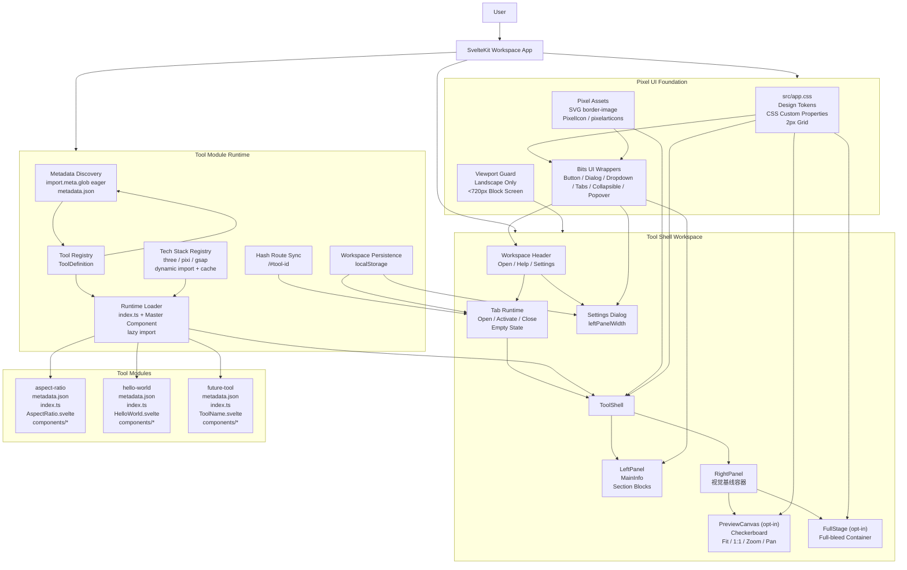

# Marble Design Toolset 框架架构设计

## 1. 文档目标

本文档用于把 2026-04-09 至 2026-04-10 期间确认的草案决策固化为一份可执行的框架架构方案。它覆盖以下内容：

- UI 设计系统与样式基线
- 总管系统与 tool 模块边界
- 目录规范、命名 schema 与运行时协议
- 技术栈按需加载机制
- 首轮重构的实施顺序

本文档面向后续开发、OpenSpec 变更实施，以及后续编写 AGENTS.md 时的基准说明。

## 2. 项目背景

当前仓库仍处于最小化 SvelteKit 项目阶段，存在以下问题：

- 依赖 TailwindCSS 与 Tailwind 工具类，和目标像素风 UI 方向冲突
- tool 顶层结构尚未被框架层强约束，tool 自身承担了过多壳层布局职责
- 组件目录、tool 命名规范、注册协议和技术栈加载协议尚未固化
- 现有页面仍是单页 demo 结构，不足以支撑后续多个 tool 并行扩展

本轮目标不是做某一个具体工具，而是先搭建出一套可以长期承载多个工具的 Pixel Art 风格前端框架。

## 3. 强约束

以下约束必须视为框架级规则，而不是普通建议：

### 3.1 样式与单位

- 移除所有 TailwindCSS 相关依赖与用法
- 不引入 CSS 框架库
- 使用 CSS Custom Properties 作为全局设计 token 基础
- `font-size`、`margin`、`padding`、`gap` 等尺寸统一使用 `px`
- 缩放通过浏览器缩放行为完成，不依赖 rem-based 自适应系统

### 3.2 视觉方向

- 项目 UI 风格为 Pixel Art
- 暂时使用 monospace 作为过渡字体
- 后续可替换为自定义像素字体资源
- 图标使用 `pixelarticons` 的 raw SVG 导入方案
- 边框使用 SVG `border-image`

### 3.3 语言与响应式

- 当前设计阶段只设计英文文案
- 应用是纯横屏应用，不做竖屏适配
- 不做过度响应式设计
- 当视口宽度小于 720px 时，应用主界面不渲染，显示黑色背景和英文提示

### 3.4 UI 库边界

- 使用 Bits UI 作为无头交互原语库
- 所有交互型基础组件优先基于 Bits UI 包装
- 所有布局型组件由项目手写实现

## 4. 总体分层

框架分为四层：

```text
Application Workspace
├── Workspace Shell
│   ├── Header / Tabs / Dialogs / Settings
│   ├── LeftPanel / RightPanel / MainInfo / Section
│   ├── PreviewCanvas (opt-in 2D zoom/fit/pan)
│   └── FullStage (opt-in full-bleed container)
├── UI Foundation
│   ├── CSS Tokens
│   ├── Bits UI Wrappers
│   ├── Pixel Icons
│   └── Border Assets
├── Tool Runtime
│   ├── Tool Registry
│   ├── Hash Routing
│   ├── Tab State / Persistence
│   └── Tech Stack Loader
└── Tool Modules
    ├── metadata.json
    ├── index.ts
    ├── Master .svelte
    └── private components/
```

职责边界：

- Workspace Shell 负责所有 tool 共有的壳层交互与布局结构
- UI Foundation 负责视觉基线、原子交互组件和共享样式约定
- Tool Runtime 负责 tool 的发现、加载、注册、状态恢复和外部技术栈注入
- Tool Modules 只负责自己的参数 UI 与预览逻辑，不负责全局壳层

## 4.1 总览架构图

下面这张 Mermaid 图用于从整体上展示 Foundation、Shell、Runtime 与 Tool Modules 的边界关系：



## 5. 设计系统

## 5.1 Token 策略

全局 token 定义于 `src/app.css`，由 `:root` 暴露，至少覆盖以下组别：

- 颜色：背景层级、前景文字、边框、强调色、危险色、成功色
- 间距：基于 2px 网格
- 字体：字号、行高、字重
- 边框：边框厚度、border-image slice、焦点边框
- 层级：z-index
- 动效：持续时间、缓动

建议 token 命名示例：

```css
:root {
	--color-bg-base: #1e1e2e;
	--color-bg-surface: #252535;
	--color-bg-elevated: #2d2d3f;
	--color-bg-inset: #1a1a28;

	--color-fg-primary: #e0e0e8;
	--color-fg-secondary: #a0a0b0;
	--color-fg-muted: #6a6a7a;

	--color-border: #3a3a4a;
	--color-border-subtle: #2e2e3e;
	--color-border-focus: #9580ff;

	--color-accent: #9580ff;
	--color-accent-hover: #b0a0ff;
	--color-danger: #e5534b;
	--color-success: #57ab5a;

	--space-1: 2px;
	--space-2: 4px;
	--space-3: 8px;
	--space-4: 16px;
	--space-5: 24px;
	--space-6: 32px;

	--font-size-1: 10px;
	--font-size-2: 12px;
	--font-size-3: 14px;
	--font-size-4: 16px;
	--font-size-5: 20px;

	--duration-fast: 120ms;
	--duration-base: 180ms;
	--duration-slow: 260ms;
}
```

## 5.2 配色原则

- 主基调为暗蓝灰专业设计工具风格
- 强调色使用紫色
- 所有层级关系优先通过明度差表达，不依赖过度饱和颜色
- Canvas 区域之外的背景保持低刺激、长时间工作友好

## 5.3 间距与排版

- 所有共享布局间距基于 2px 网格
- LeftPanel 内容默认 `flex-direction: column`，常规区块 gap 为 8px
- Section 内部可使用 4px、8px、16px 三个常见层级
- Typography 暂时偏终端/工具软件感，而非品牌型展示感

## 5.4 图标与边框

- 图标：使用 `pixelarticons` raw SVG 导入，统一经过 `PixelIcon` 组件渲染
- 边框：使用共享 SVG `border-image` 资源
- 先做一套通用边框，后续再扩展 hover/active 变体

## 6. Bits UI 使用基线

本项目使用 Bits UI 的方式遵循以下规则，这些规则后续也要同步写入 AGENTS.md：

### 6.1 适用范围

以下交互原子组件使用 Bits UI：

- Button
- Dialog
- DropdownMenu
- Popover
- Collapsible
- Tabs

以下组件手写：

- ToolShell
- LeftPanel
- RightPanel
- MainInfo
- Section
- PreviewCanvas
- 任何纯布局容器

### 6.2 样式原则

- Bits UI 是无头组件，不引入其 demo 中的 class 命名
- 样式由项目自己的 CSS、CSS 变量、`data-*` 状态属性负责
- 不把 Tailwind class 当成 Bits UI 的使用基准

### 6.3 Child Snippet 规则

当使用 Bits UI 的 `child` snippet 时：

- 自定义元素必须完整透传 `{...props}`
- 浮动类组件必须保留两层结构：外层 `{...wrapperProps}`，内层 `{...props}`
- 外层 wrapper 不得承载视觉样式
- 如果要做 Svelte transition 或 GSAP 进入/退出动效，必须使用 `forceMount + child`

标准浮动内容写法：

```svelte
<DropdownMenu.Content forceMount>
	{#snippet child({ wrapperProps, props, open })}
		{#if open}
			<div {...wrapperProps}>
				<div {...props}>
					<!-- styled content -->
				</div>
			</div>
		{/if}
	{/snippet}
</DropdownMenu.Content>
```

### 6.4 状态管理原则

- 优先使用 `bind:` 绑定 Bits UI 的 bindable props
- 当需要做校验、节流、额外状态联动时，使用 function binding
- 组件外部状态统一使用 Svelte 5 runes 风格

## 7. 组件目录规范

共享组件统一位于 `src/lib/components/`，并按职责拆分为两大类：

```text
src/lib/components/
├── shell/
│   ├── tool-shell/
│   │   ├── ToolShell.svelte
│   │   └── index.ts
│   ├── left-panel/
│   │   ├── LeftPanel.svelte
│   │   └── index.ts
│   ├── right-panel/
│   │   ├── RightPanel.svelte
│   │   └── index.ts
│   ├── main-info/
│   │   ├── MainInfo.svelte
│   │   └── index.ts
│   ├── section/
│   │   ├── Section.svelte
│   │   └── index.ts
│   ├── preview-canvas/
│   │   ├── PreviewCanvas.svelte
│   │   └── index.ts
│   └── index.ts
└── ui/
	├── button/
	│   ├── Button.svelte
	│   └── index.ts
	├── dialog/
	│   ├── Dialog.svelte
	│   └── index.ts
	├── dropdown-menu/
	│   ├── DropdownMenu.svelte
	│   └── index.ts
	├── collapsible/
	│   ├── Collapsible.svelte
	│   └── index.ts
	├── tabs/
	│   ├── Tabs.svelte
	│   └── index.ts
	├── pixel-icon/
	│   ├── PixelIcon.svelte
	│   └── index.ts
	└── index.ts
```

命名规则：

- 文件夹：`kebab-case`
- 组件文件：`PascalCase.svelte`
- 每个子文件夹带 `index.ts`
- `shell/index.ts` 和 `ui/index.ts` 提供二级统一导出

## 8. Tool 模块 schema

每个 tool 必须遵循严格目录规范：

```text
src/tools/{tool-id}/
├── index.ts
├── metadata.json
├── {ToolName}.svelte
└── components/
	├── {PrivateComponent}.svelte
	└── ...
```

规则如下：

- `tool-id` 使用 `kebab-case`
- 主入口组件 `{ToolName}.svelte` 必须与 `tool-id` 严格对应
- 根目录只允许存在一个主入口 `.svelte`
- 额外的 `.svelte` 子组件必须放到 `components/` 内
- `metadata.json` 只承载静态元数据与静态可用性开关
- `index.ts` 承载 tool 运行时定义

示例：

```text
src/tools/aspect-ratio/
├── index.ts
├── metadata.json
├── AspectRatio.svelte
└── components/
	├── PresetGrid.svelte
	├── DimensionFields.svelte
	└── RatioPreview.svelte
```

## 9. Tool Runtime 合约

`index.ts` 的职责不是直接承担页面渲染，而是定义 tool 的注册信息。

建议类型：

```ts
export type TechStackKey = 'three' | 'pixi' | 'gsap';

export interface ToolMetadata {
	name: string;
	desc: string;
	tag: string[];
	version: string;
	enabled?: boolean;
}

export interface ToolMenuAction {
	id: string;
	label: string;
	icon?: string;
	disabled?: boolean;
}

export interface ToolDefinition {
	metadata: ToolMetadata;
	menuActions?: ToolMenuAction[];
	techStack?: TechStackKey[];
	loadComponent: () => Promise<{ default: unknown }>;
}
```

推荐写法：

```ts
import metadata from './metadata.json';
import type { ToolDefinition } from '$lib/types/tool';

const definition = {
	metadata,
	menuActions: [{ id: 'about', label: 'About' }],
	techStack: ['gsap'],
	loadComponent: () => import('./AspectRatio.svelte')
} satisfies ToolDefinition;

export default definition;
```

## 10. 总管系统设计

## 10.1 壳层结构

Workspace 页面布局如下：

```text
┌──────────────────────────────────────────────────────────────┐
│ Marble Design Toolset      Open   Help   Settings           │
├──────────────────────────────────────────────────────────────┤
│ Tab A   Tab B   Tab C   ...                                 │
├──────────────────────────────────────────────────────────────┤
│ LeftPanel                                 RightPanel        │
│ ┌────────────────────┐   ┌────────────────────────────────┐ │
│ │ MainInfo           │   │ Preview Toolbar               │ │
│ │ Section            │   │ Preview Stage                 │ │
│ │ Section            │   │ Checkerboard Background       │ │
│ └────────────────────┘   └────────────────────────────────┘ │
└──────────────────────────────────────────────────────────────┘
```

## 10.2 Header

Header 固定包含：

- 应用标题 `Marble Design Toolset`
- `Open` 按钮
- `Help` 按钮
- `Settings` 按钮

说明：

- 不保留 `File` 菜单
- `Settings` 使用单独按钮，不混入别的下拉
- `Open` 与 `Help` 通过 DropdownMenu 或 Dialog 呈现

## 10.3 Tab System

Tab 行为：

- 只展示当前已打开的 tool
- 支持打开/关闭 tab
- 不支持拖拽排序
- 从 localStorage 恢复上次打开的 tab 集合与活动 tab
- 所有 tab 关闭后显示空状态引导界面

## 10.4 LeftPanel

LeftPanel 的职责是承载 tool 参数区与说明区，框架结构固定：

```svelte
<LeftPanel>
	<MainInfo />
	<Section />
	<Section />
</LeftPanel>
```

LeftPanel 规则：

- 主体为垂直流布局
- 默认 gap 为 8px
- 宽度由全局设置控制，单位为 `vw`
- 初始设置范围最小化，只支持 `leftPanelWidth`

## 10.5 MainInfo

MainInfo 固定出现在 LeftPanel 顶部，内容包括：

- tool title
- tool desc
- 右上角常驻菜单按钮

菜单结构：

- 上半部为 tool 自定义 menu actions
- 中间固定 divider
- 底部固定 `About`

`About` 点击后展示 metadata 信息。

## 10.6 Section

Section 是 LeftPanel 的主分区容器，至少支持：

- `title`
- `children`
- `collapsible?`

职责：

- 提供统一背景和 outline
- 提供统一的 section 标题样式
- 为后续 tool 内容提供稳定容器边界

## 10.7 RightPanel 与 PreviewCanvas

RightPanel 负责承载预览区域。预览不要求一定是 `<canvas>`，它可以是：

- DOM 预览
- 2D Canvas
- PixiJS 视图
- Three.js 渲染容器

框架提供统一的 `PreviewCanvas` 壳层：

- 棋盘格背景
- 缩放百分比显示
- `Fit` 按钮
- `1:1` 按钮
- 放大 / 缩小按钮
- 拖拽平移
- 滚轮缩放

因此，tool 只需要提供预览内容，不需要自行实现通用的视图操作栏。

## 11. Tool 与总管的组合方式

每个 tool 使用一个主入口 Svelte 组件作为 master，master 负责组织自身状态与私有子组件。

组合方式：

```svelte
<LeftPanel>
	<Section title="Presets">
		<PresetGrid />
	</Section>
	<Section title="Dimensions">
		<DimensionFields />
	</Section>
</LeftPanel>

<RightPanel>
	<RatioPreview />
</RightPanel>
```

要点：

- tool 只允许有一个 master 入口组件
- tool 可以拆分自己的私有子组件
- 私有子组件只能作为该 tool 内部实现细节存在
- 总管系统通过 context 向壳层组件注入 metadata、menu actions、workspace controls

## 12. 路由与持久化

## 12.1 路由

- 使用 hash 路由：`/#tool-id`
- 不为每个 tool 建立独立 SvelteKit page route
- 这样能兼容 GitHub Pages 静态部署

规则建议：

- 切换活动 tool 时同步更新 hash
- 首次进入页面时，如果 hash 指向有效 tool，则优先激活该 tool
- 若 hash 无效，再回退到 localStorage 恢复状态

## 12.2 本地持久化

使用 localStorage 保存：

- 已打开 tab 列表
- 当前活动 tab
- leftPanel 宽度

建议 state：

```ts
interface WorkspaceState {
	openToolIds: string[];
	activeToolId: string | null;
	leftPanelWidthVw: number;
}
```

## 13. Tool 发现与加载策略

## 13.1 自动发现

采用两段式发现：

- `metadata.json` 通过 `import.meta.glob(..., { eager: true })` 预加载
- `index.ts` 通过 lazy glob 在真正打开 tool 时加载

原因：

- tool 列表、Open 菜单、About 信息需要快速获得元数据
- tool 是否处于启用状态需要在不加载运行时代码的前提下被判定
- tool 组件和大依赖不能首屏全部打包进来

## 13.2 加载流程

```text
App boot
  -> eager load all metadata.json
	-> build enabled tool catalog
User opens tool
  -> lazy import src/tools/<id>/index.ts
  -> read techStack declarations
  -> load required external modules
  -> load master component
  -> mount inside ToolShell
```

## 14. 技术栈按需加载协议

## 14.1 支持清单

- 原生 JS：简单数值计算，不走 registry
- Svelte + CSS：默认内建，不走 registry
- Three.js：3D 预览
- PixiJS：2D 图形渲染
- GSAP：动画引擎

## 14.2 Registry 设计

建议创建共享 registry：

```ts
type TechStackKey = 'three' | 'pixi' | 'gsap';

const loaders = {
	three: () => import('three'),
	pixi: () => import('pixi.js'),
	gsap: () => import('gsap')
};
```

设计要求：

- registry 负责动态 import
- 同一技术栈只加载一次
- 已加载模块进入缓存
- tool 在挂载前必须先完成依赖加载门控

工具层访问模式：

- tool 声明 `techStack`
- ToolShell 调用 loader
- tool 组件通过共享 API 获取已加载模块

## 14.3 不做的事情

- 不为未声明依赖的 tool 预加载 Three.js / PixiJS / GSAP
- 不把技术栈加载写死在页面组件中

## 15. 小屏约束

当宽度 `< 720px` 时：

- 隐藏应用工作区
- 整屏纯黑背景
- 显示英文提示，说明需要更宽的屏幕

建议提示文案：

```text
This workspace requires a minimum width of 720px.
Please use a wider screen.
```

## 16. 依赖策略

## 16.1 移除

- `tailwindcss`
- `@tailwindcss/vite`
- `tailwind-merge`
- `clsx`
- `lucide-svelte`

## 16.2 新增

- `pixelarticons`
- `gsap`
- `pixi.js`
- `three`

## 16.3 保留

- `svelte`
- `@sveltejs/kit`
- `@sveltejs/adapter-static`
- `vite`
- `bits-ui`

## 17. 首轮实施顺序

建议按以下顺序重构：

### Phase 1: 清理与基础设施

- 移除 Tailwind 依赖与 Vite 插件
- 重建 `app.css`
- 增加新依赖与共享 types

### Phase 2: UI Foundation

- 实现 Button / Dialog / DropdownMenu / Tabs / Collapsible / PixelIcon
- 建立 border-image 与 checkerboard 背景能力

### Phase 3: Workspace Shell

- 实现 ToolShell、Header、TabBar、LeftPanel、RightPanel、MainInfo、Section、PreviewCanvas
- 实现 Settings / Help / About

### Phase 4: Runtime

- 实现 metadata eager discovery
- 实现 tool runtime lazy loading
- 实现 hash 路由和 localStorage 恢复
- 实现 tech stack registry

### Phase 5: Tool 迁移

- 迁移 `aspect-ratio`
- 迁移 `hello-world`
- 删除旧页面层的 component map 和 Tailwind class 写法

### Phase 6: 文档与 AI 规则

- 编写 AGENTS.md
- 更新 README
- 校验 build 与 GitHub Pages 产物

## 18. OpenSpec 对应能力

本文档对应本轮 OpenSpec change 的三个 capability：

- `pixel-ui-foundation`
- `tool-shell-workspace`
- `tool-module-runtime`

职责划分：

- `pixel-ui-foundation` 负责 token、Bits UI 包装规则、像素图标/边框、最小宽度约束
- `tool-shell-workspace` 负责 header、tabs、dialogs、settings、LeftPanel/RightPanel、预览交互
- `tool-module-runtime` 负责 tool schema、注册发现、动态 import、技术栈注入协议

## 19. 当前结论

本轮方案的核心不是“把某个 demo 做得更漂亮”，而是建立一套长期可维护的、风格与运行时边界都明确的 tool workspace 框架。后续新增 tool 时，必须优先服从框架 contract，而不是反过来让单个 tool 拉扯壳层设计。
