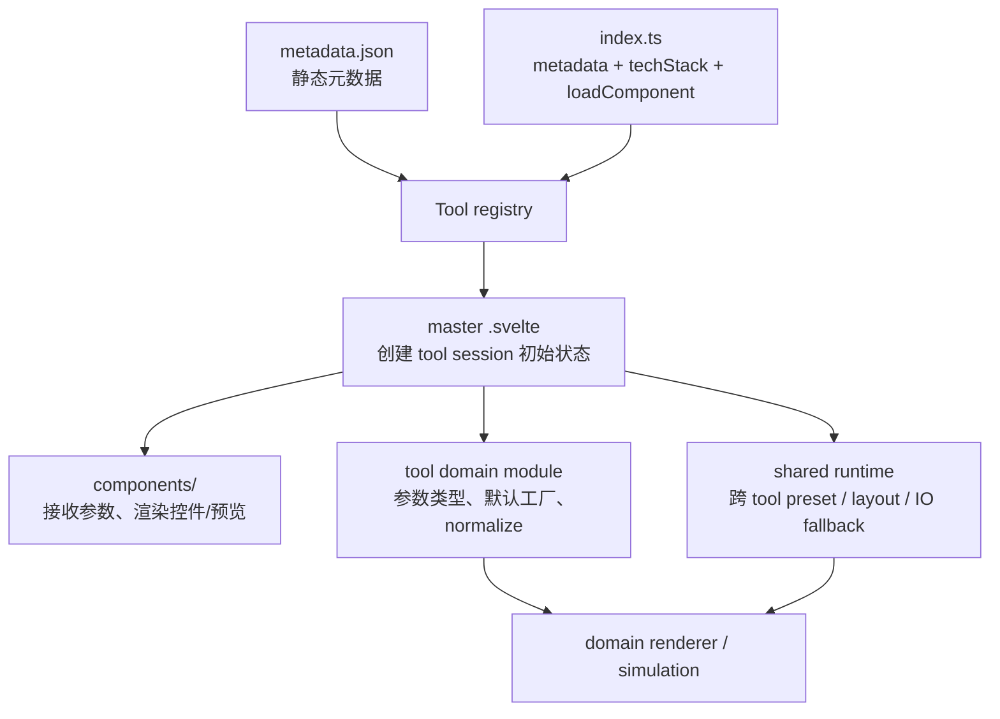
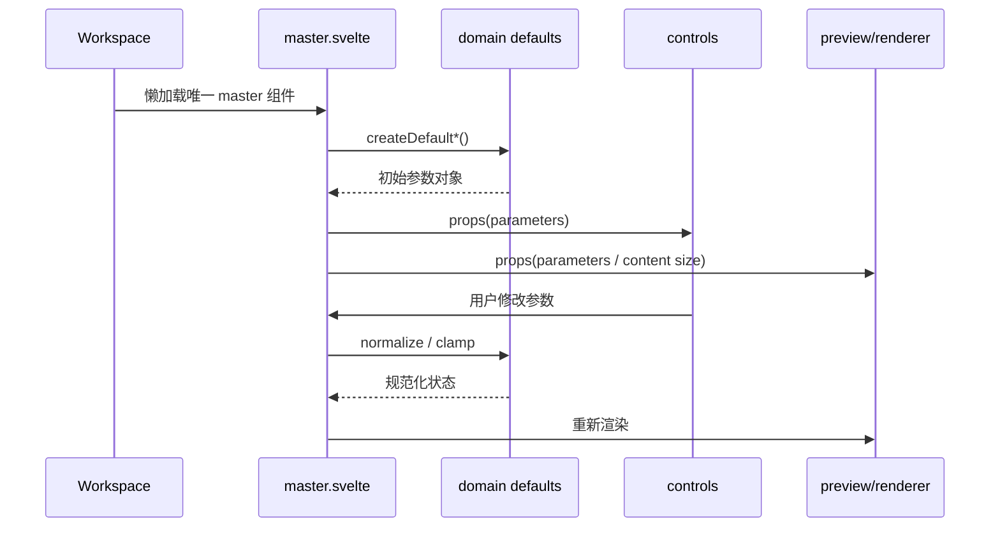

# Tool 默认参数与初始状态

> **定位**：梳理当前 6 个 tool 的默认参数、初始 UI 状态、预设、参数范围和 runtime fallback 的实际放置位置。

## 1. 架构地图

[VERIFIED] 默认值没有放进 `metadata.json` 或 `index.ts`。`metadata.json` 只描述静态元数据，`index.ts` 只描述 runtime definition 和懒加载入口。

### 默认值的层级

| 层级 | 位置 | 负责内容 | 是否放 tool 业务默认值 |
|---|---|---|---|
| 静态描述 | `src/tools/<id>/metadata.json` | name、desc、tag、version、enabled、export 能力 | 否 |
| runtime 定义 | `src/tools/<id>/index.ts` | `loadComponent`、`techStack`、menu actions | 否 |
| session 初始状态 | master `.svelte` | 当前 tool 的 `$state`、默认选中项、默认预览尺寸 | 是，简单 tool 直接放这里 |
| 领域默认值 | `noise/shared.ts`、`simulation/parameters.ts` | 参数对象默认工厂、领域常量、normalize | 是，复杂 tool 推荐放这里 |
| 共享默认值 | `src/lib/runtime/*` | 通用 layout、PreviewCanvas、export、file input fallback | 只放 framework 级 fallback |
| 控件组件 | `components/*` | label、min/max、step、输入事件 | 通常不放初始值 |

## 2. 每个 tool 的放置位置

### 2.1 `aspect-ratio`

**默认值全部集中在** `src/tools/aspect-ratio/AspectRatio.svelte`。

| 状态/参数 | 默认值 | 放置位置 |
|---|---:|---|
| ratio | `16:9` | `ratioW = 16`、`ratioH = 9` |
| canvas size | `1920 × 1080` | `widthPx = 1920`、`heightPx = 1080` |
| 当前预设 | `16:9` | `activePreset = "16:9"` |
| 自定义比例输入 | 空字符串 | `customRatioW`、`customRatioH` |
| 内置比例预设 | `16:9`、`4:3`、`1:1` 等 | `PRESETS` 常量 |
| 预览 zoom | `1:1` | `<PreviewCanvas defaultZoom="1:1">` |

[VERIFIED] 没有单独的参数模型或默认工厂；主组件同时承担默认状态、校验、比例计算和 UI 组合。

### 2.2 `chromatic-aberration`

**用户参数的源头在** `src/tools/chromatic-aberration/ChromaticAberration.svelte`。

| 参数组 | 默认值 | 放置位置 |
|---|---|---|
| source size | `800 × 600` | `sourceWidth` / `sourceHeight` 的无输入 fallback，以及 `resolvedWidth` / `resolvedHeight` 初值 |
| warp center | `(0.5, 0.5)` | master `$state` |
| warp distance | `0` | master `$state` |
| radial strength | `0.3` | master `$state` |
| channel radial | `red=-1`、`green=0`、`blue=1` | master `$state` |
| channel offset | RGB 各自 `x=0,y=0` | master `$state` |
| output intensity | `1.0` | master `$state` |
| preview zoom | `Fit` | `<PreviewCanvas defaultZoom="Fit">` |

`src/tools/chromatic-aberration/components/AberrationCanvas.svelte` 的 `buildUniformGroup()` 又写了一份相同的 shader uniform 初始值，并在 Pixi 初始化、无输入及媒体尺寸异常时使用 `800 × 600` fallback。

[VERIFIED] 实际交互参数由 master 传入，子组件负责把 props 同步到 shader；因此 `AberrationCanvas.svelte` 的 uniform 初值属于渲染 bootstrap/fallback，不是独立的业务配置源。这里存在一份需要同步维护的重复默认值。

### 2.3 `hello-world`

该 tool 没有可配置参数和 `$state`。

| 默认内容 | 默认值 | 放置位置 |
|---|---:|---|
| preview size | `640 × 360` | `HelloWorld.svelte` 的 `<PreviewCanvas>` props |
| preview zoom | 未显式传入，使用共享默认 `Fit` | `src/lib/components/shell/preview-canvas/PreviewCanvas.svelte` |
| preview 文案 | 静态英文文案 | `HelloWorld.svelte` markup |

[VERIFIED] 这是固定展示型 tool，默认值就是 master markup 中的固定 props/文本。

### 2.4 `layout-smoke-test`

这个 tool 的默认值分成两层：tool 自己的内容状态，以及传给共享 layout controller 的配置。

**tool 内容状态：`src/tools/layout-smoke-test/LayoutSmokeTest.svelte`**

| 状态 | 默认值 |
|---|---:|
| headline | `Layout Smoke Test` |
| subtitle | `Responsive DOM layout template` |
| accent | `#9580ff` |
| Google Font 输入框 | `Inter` |
| Google Font URL 输入框 | 空字符串 |

**layout controller 配置：同一个 master 的 `createLayoutToolController({...})`**

| 配置 | 默认值 |
|---|---:|
| canvas | `1080 × 1080` |
| size limits | 宽高均为 `320..4096` |
| actual CSS family initial value | `system-ui, sans-serif` |
| system fallback | `system-ui, sans-serif` |
| Google weights | `[400, 700]` |
| source slots | `hero`、`logo`、`font`，均非必需；大小上限分别为 `12/4/8 MB` |
| exporter id / label | `layout-template` / `Layout Smoke Test Layout` |

`src/lib/runtime/layout-tool/layout-tool.svelte.ts` 负责把 `defaultWidth` / `defaultHeight` 转成初始输入和 reset 值，并在输入非法时回退到这些默认值；`defaultFamily` 缺省时才使用 runtime 内部的 `system-ui, sans-serif` fallback。

[VERIFIED] `googleFontFamily = "Inter"` 只是左侧输入框的默认草稿值，不等于实际当前 CSS 字体；实际字体由 controller 的 `defaultFamily` 初始化为 `system-ui, sans-serif`。

### 2.5 `noise-texture-creater`

主组件 `src/tools/noise-texture-creater/NoiseTextureCreater.svelte` 只负责选择默认噪声族并调用默认工厂；参数源集中在 `src/tools/noise-texture-creater/noise/shared.ts`。

| 参数对象 | 默认值 |
|---|---|
| active family | `perlin`，在 master `$state` 初始化 |
| shared | `seed=13`、`scale=6`、`offsetX=0`、`offsetY=0`、`brightness=0`、`contrast=1` |
| perlin | `octaves=4`、`persistence=0.5`、`lacunarity=2`、`exponent=1.15` |
| voronoi | `cellDensity=9`、`jitter=0.2`、`edgeWidth=0.02`、`edgeSoftness=0.28`、`pointRadius=1.32`、`pointSharpness=0.78`、`fillStrength=0.02`、`cellVariation=0.08` |
| preview size | `512 × 512`，`PREVIEW_SIZE = 512` |
| preview zoom | `1:1` |

具体位置：

- `createDefaultSharedNoiseParameters()`、`createDefaultPerlinNoiseParameters()`、`createDefaultVoronoiNoiseParameters()`：默认参数工厂。
- `VORONOI_PRESETS`：Voronoi 预设集合；应用预设时 master 只替换 `voronoi` 参数对象。
- `src/tools/noise-texture-creater/noise/controller.ts`：`sanitizeNoiseToolState()` 负责运行时 normalize；`generateNoiseTexture(size = PREVIEW_SIZE)` 提供尺寸 fallback。
- `NoiseControls.svelte`：只声明 slider 的 min/max/step 和事件转换，不持有默认值。

[VERIFIED] 这是当前 6 个 tool 中默认参数分层最清晰的实现：master 管 session state，`noise/shared.ts` 管参数模型与默认工厂，`controller.ts` 管校正和生成。

### 2.6 `shallow-water-height`

默认值分为 simulation 参数、init map preset 和 source mode 三部分。

**simulation 参数：`src/tools/shallow-water-height/simulation/parameters.ts`**

| 参数 | 默认值 |
|---|---:|
| resolution | `256` |
| amplitude | `0.45` |
| waveSpeed | `0.18` |
| flowX / flowY | `0 / 0` |
| distortStrength | `0` |
| distortScale | `4` |
| distortSpeed | `0.01` |
| damping | `0.995` |
| edgeAbsorb | `0.9` |
| restThreshold | `0.00003` |
| stepsPerFrame | `2` |
| contrast | `1.8` |
| invert | `false` |

`createDefaultShallowWaterParameters()` 是唯一的初始参数工厂；`normalizeParameters()` 是统一范围校正入口。`simulation/shared.ts` 通过 `export * from './parameters.js'` 对 simulation 内部消费者重新导出这些类型和函数。

**init map preset：`src/lib/runtime/preset-init-map.ts`**

`createDefaultPresetInitMap(kind = 'circle')` 是共享 runtime 的默认 preset 工厂：

- circle：中心 `(0.5,0.5)`、size `0.34`、feather `0.05`、fill、outline width `0.08`
- square：中心 `(0.5,0.5)`、size `0.38`、feather `0.05`、fill、outline width `0.08`
- horizontal-bar / vertical-bar：position `0.5`、thickness `0.18`、feather `0.05`

`normalizePresetInitMap()` 负责 clamp；`renderPresetInitMap()` 只负责把 descriptor 栅格化，不重新定义默认值。

**tool session state：`src/tools/shallow-water-height/ShallowWaterHeight.svelte`**

- `parameters`：`createDefaultShallowWaterParameters()`
- `sourceMode`：`INIT_MAP_SOURCE_MODES[0]`，当前为 `preset`
- `preset`：`createDefaultPresetInitMap()`，当前默认为 filled circle
- `resimulateToken`：`0`

`ShallowWaterControls.svelte` 仅负责控件和 min/max/step；`ShallowWaterPreview.svelte` 负责将当前参数传给 Three renderer。

[VERIFIED] `simulation/wave-renderer.ts` 中的 shader uniform 初始值（如 `waveSpeed=0.16`、`damping=0.992`、`restThreshold=0.0001`）是 GPU material bootstrap 值；真正的 simulation 参数在 `step(parameters)` / `render(parameters)` 中从 master 状态同步。它们不是新的用户默认参数源，但与参数工厂形成了重复常量。

## 3. 数据流

## 4. 设计决策与风险

| 决策 | 结果 | 评价 |
|---|---|---|
| 不把 tool 默认状态放进 metadata | catalog 不加载运行时代码也能工作 | 正确；metadata 保持静态 |
| 简单 tool 直接在 master `$state` 初始化 | diff 小、状态流直观 | 适合 `aspect-ratio`、`chromatic-aberration` |
| 复杂参数使用 `createDefault*()` | reset、测试、初始化复用同一来源 | `noise`、`shallow-water` 的推荐模式 |
| 共享 preset 放在 runtime | 多个 tool 可复用确定性 preset 生成 | `preset-init-map.ts` 不应反向依赖具体 tool |
| 控件只提供范围和交互 | UI 不接管业务状态 | 当前职责边界清晰 |
| renderer 保留 uniform bootstrap 值 | GPU 对象可以先完成初始化 | CA 与 shallow-water 存在重复常量，长期应避免数值漂移 |

## 5. 附录

### 符号映射

| 符号 | 位置 | 作用 |
|---|---|---|
| `createDefaultSharedNoiseParameters` | `noise/shared.ts` | noise 共享参数默认工厂 |
| `createDefaultShallowWaterParameters` | `simulation/parameters.ts` | shallow-water simulation 默认工厂 |
| `createDefaultPresetInitMap` | `src/lib/runtime/preset-init-map.ts` | 共享 init map preset 默认工厂 |
| `createLayoutToolController` | `src/lib/runtime/layout-tool/layout-tool.svelte.ts` | layout 尺寸/字体/source/export 状态控制器 |
| `PreviewCanvas.defaultZoom` | `PreviewCanvas.svelte` | 预览首次打开 zoom；默认 `Fit` |
| `resolveCapabilities` | `canvas-export/registry.svelte.ts` | exporter capability fallback，不属于 tool 参数 |

### 不应混淆的 framework 默认值

- `src/lib/runtime/workspace-state.ts` 的 `DEFAULT_LEFT_PANEL_WIDTH_VW = 28` 是 workspace 壳层默认值，不是任何 tool 参数。
- `PreviewCanvas.svelte` 的 `defaultZoom = 'Fit'` 是预览组件默认值；tool 可以通过 props 覆盖。
- `canvas-export/registry.svelte.ts` 的 PNG/MP4/bit-depth fallback 是导出 runtime 默认值；tool 的 `metadata.json.export` 只声明能力。
- `src/lib/runtime/file-input/*` 的 picker、object URL、文件类型处理 fallback 是 IO runtime 默认值；tool 只传 `allowedKinds` 或 slot 配置。

### 相关文档

- [Tool 目录与职责](../for-tool-developers/create-a-tool.md)
- [Host-tool boundary](../for-framework-developers/host-tool-boundary.md)
- [Noise tool specification](../../openspec/specs/noise-texture-tool/spec.md)
- [Shallow water specification](../../openspec/specs/shallow-water-height-tool/spec.md)
